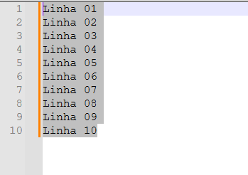
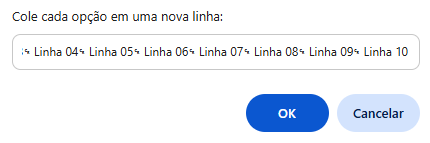
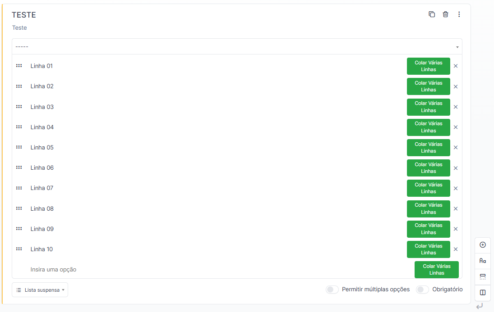

# glpi_adicionar_varias_linhas_lista_suspensa

Script para **automatizar a inserção de várias linhas em campos do tipo "lista suspensa" no GLPI 11**, evitando trabalho manual e tornando a experiência mais rápida.

> Na versão 11 do GLPI, o formulário é nativo e o campo do tipo "lista suspensa" (equivalente ao tipo "Selecionar" do GLPI 10) não aceita multi-colagem: ao colar texto, todas as opções ficam juntas em uma única linha.  
> Este script adiciona um botão “Colar Várias Linhas” em cada opção, permitindo adicionar rapidamente várias linhas ao campo.

### Pré-requisitos

- **Extensão Tampermonkey**:  
  <a href="https://chromewebstore.google.com/detail/tampermonkey/dhdgffkkebhmkfjojejmpbldmpobfkfo?hl=pt-BR" target="_blank">Tampermonkey para Chrome</a>

### Passo a Passo  

#### 1. Adicione o script na Tampermonkey e salve

Abra o painel do Tampermonkey, cole o código do script e salve.

---

#### 2. Copie o texto que deseja adicionar

Copie todas as opções que deseja adicionar de um bloco de notas, como no exemplo abaixo:

---

#### 3. Abra o formulário no GLPI

Crie um campo do tipo “lista suspensa”, ou acesse um já existente onde deseja adicionar várias opções.  

---

#### 4. Clique no botão "Colar Várias Linhas"  

O botão aparece ao lado dos campos que permitem adicionar opções, conforme abaixo:

---

#### 5. Cole o texto na caixa de diálogo  

Ao clicar no botão, aparecerá uma caixa para colar o texto, conforme figura abaixo:

Cole as opções e elas ficarão na caixa de texto conforme a figura abaixo. Clique em OK.

---

#### 6. Aguarde o processo terminar  

O script irá adicionar cada linha como uma opção na lista. Aguarde o preenchimento ser concluído. 

Ao final, o campo do tipo "lista suspensa" estará dessa forma, preenchido com todas as opções.  

Para adicionar mais opções, repita o processo.

---

## Observações

- O script funciona para qualquer campo do tipo "lista suspensa" compatível no GLPI versão 11.
- Se precisar adicionar centenas de linhas, tenha paciência 😉.
